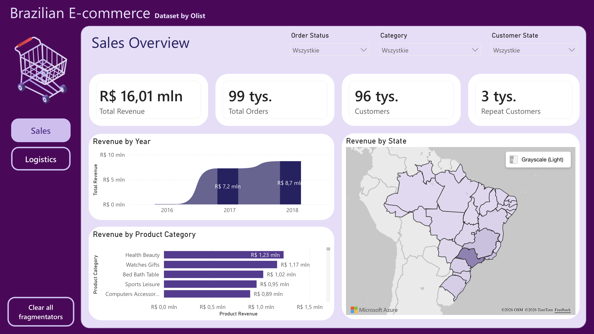
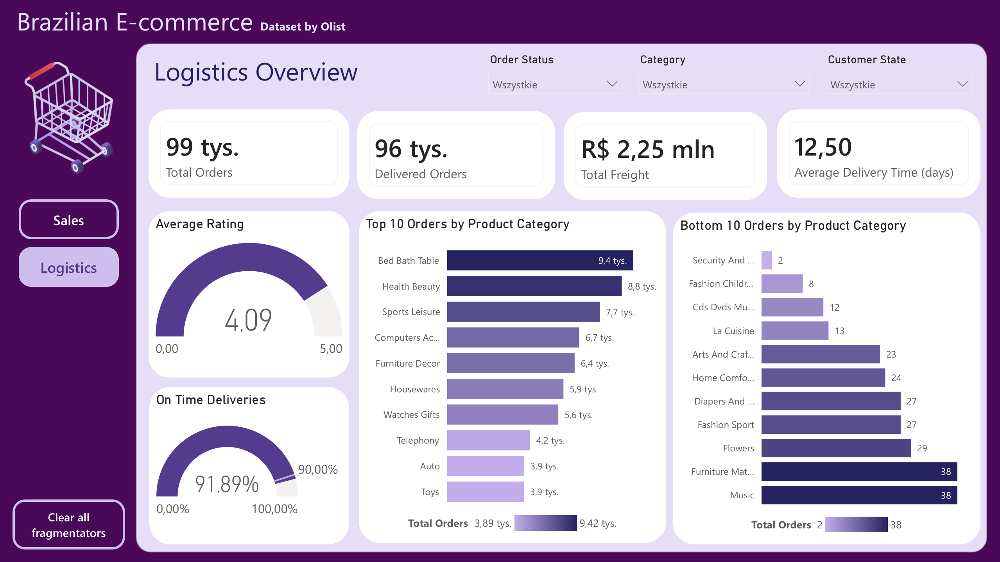
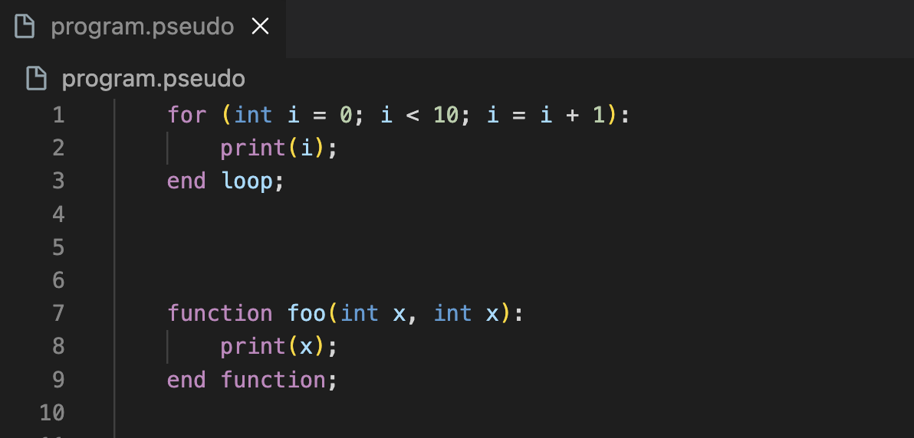
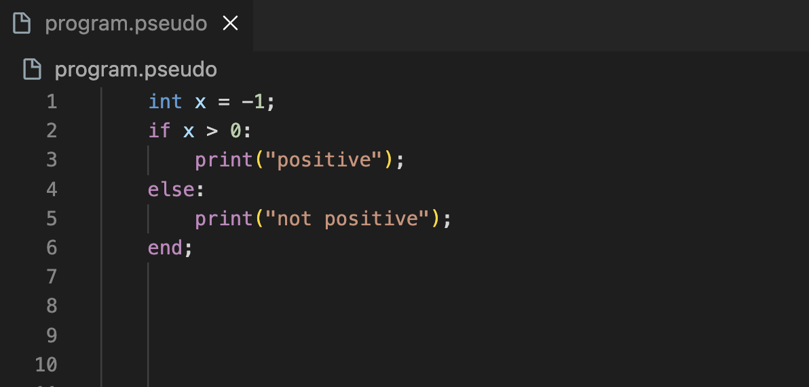
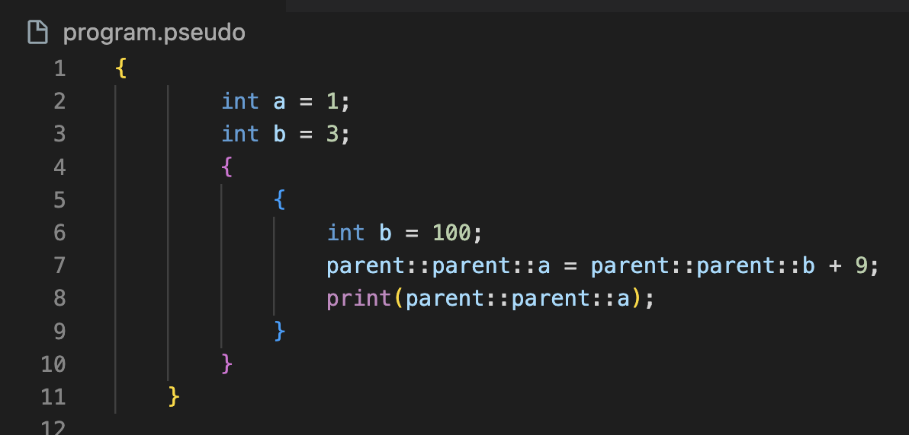

  <h1>👋 Hi, I'm Maciej</h1>
  
  <h3>Aspiring Data Engineer | 3rd-year IT Student at AGH</h3>
  
  
<i>Passionate about data engineering, Big Data, and building data-driven solutions.</i>

  

  
  

 

## 🚀 About Me
I am a Computer Science and Intelligent Systems student at AGH University of Krakow. I focus on large-scale data processing, transforming raw data into meaningful insights, and solving complex analytical problems. 

* 🔭 Currently gaining practical experience in the **Synaptica research group**, participating in designing user studies and building scientific datasets.
* 🌱 Developing skills in **Data Engineering** (ETL processes, Data Warehousing) and exploring Big Data technologies like **Spark, Kafka, and Databricks**.
* ⚡ In my free time, I tutor mathematics and enjoy strategy games and fantasy universes.

---

## 🛠 Tech Stack

> *Technologies I use for data processing, software engineering, and analytics.*

| Category | Technologies |
| :--- | :--- |
| **Languages** |    |
| **Data Engineering & DB** |    |
| **Big Data (Learning)** |    |
| **Tools & BI** |     |

---

## 🌟 Featured Projects

**[📊 Olist E-Commerce Analytics Dashboard](https://github.com/MaciejJamrozy/brazil-ecommerce-powerbi)**
An end-to-end data analytics project based on the Brazilian E-Commerce dataset.

🔻 <b>Click to see details & screenshots</b>

 
Data was initially ingested and processed via PostgreSQL. The final interactive dashboard monitors core e-commerce metrics: sales performance, logistics, and product assortment.

<b>Technical Implementations:</b>
<ul>
  <li><b>ETL & Data Cleaning:</b> Handled NULL delivery dates (canceled orders) without row deletion to preserve financial data. Resolved referential integrity violations using Left Outer Joins in Power Query.</li>
  <li><b>Data Modeling:</b> Implemented a <b>Star Schema</b> integrating fact tables (orders, payments) with geographic and product dimension tables.</li>
  <li><b>DAX Calculations:</b> Developed custom measures for financial metrics (Total Revenue, AOV) and logistical tracking (On-Time Delivery Rate).</li>
  <li><b>UI & Rendering:</b> Replaced native visual elements with custom external background images to reduce rendering load. Applied global JSON theming.</li>
</ul>
 
<table align="center">
  <tr>
    <td align="center"></td>
    <td align="center"></td>
  </tr>
</table>
 
Tech: Power BI, PostgreSQL, Python
  
🔗 <strong><a href="https://app.powerbi.com/view?r=eyJrIjoiOTI0ZDM2ODgtOTg5NC00MTFkLTllYjUtZTQ0ZDBmZWE2NzFlIiwidCI6IjgwYjEwMzNmLTIxZTAtNGE4Mi1iYmMwLWYwNWZkY2NkM2JjOCIsImMiOjl9">View Interactive Dashboard on Power BI Service</a></strong>

 

---

**[⚖️ Database Load Balancer](https://github.com/AdamSzL/design-patterns-load-balancer-java)**
A custom JDBC proxy load balancer for efficiently distributing traffic and replicating statements across multiple PostgreSQL databases, **which you can use in your app just like normal Hibernate SessionFactory!!!**

🔻 <b>Click to see more details & architecture</b>

 

**My Contributions:**
- **System Architecture:** Independently designed the core architecture of the system to ensure transparent integration with the application layer (e.g., Hibernate).
- **Load Balancing Engine:** Co-developed the traffic distribution mechanism for balancing read/write operations across multiple PostgreSQL instances running in Docker containers.
- **Design Patterns:** Actively applied core design patterns including **Strategy** (for dynamic routing algorithms), **Proxy** (for connection handling and query replication), and **Monitor Object** (for safe concurrent state modifications and protecting database consistency).

**Demo Video:**

https://github.com/user-attachments/assets/c57e118a-4d01-47e1-98f5-9cfa4460d98b

 

**Tech Stack:** Java, Hibernate, Docker, PostgreSQL

 

---

**[🏥 Medical Clinic Management System](https://github.com/MaciejJamrozy/medical-app)**
A comprehensive, full-stack web application designed for managing medical clinics with role-based access and real-time appointment booking.

🔻 <b>Click to see details & screenshots</b>

 
Built to facilitate the complete medical visit flow with distinct panels for Patients, Doctors, and Administrators. 
Key developments include:
<ul>
  <li><b>Real-time Communication:</b> Integrated WebSockets (<code>Socket.io</code>) for instant notifications on appointment status changes.</li>
  <li><b>Complex Scheduling:</b> Developed logic for doctors to define cyclical availability and report specific absences natively from their dashboards.</li>
  <li><b>Secure Authentication:</b> Implemented stateful sessions using JWT and role-based route protection.</li>
</ul>
 
<table align="center">
  <tr>
    <td align="center"></td>
    <td align="center"></td>
  </tr>
</table>
 
Tech: React 19, TypeScript, Node.js, Express, Sequelize (ORM), Socket.io

 

---

**[💻 Project Pseudo](https://github.com/MaciejJamrozy/projectPseudo)**

**Compiler Construction:** Designed and implemented a fully functional interpreter for a custom, strongly-typed programming language built from scratch.

🔻 <b>Click to see engineering deep-dive & screenshots</b>

 
<b>Key Architecture & Implementations:</b>
<ul>
  <li><b>Language Pipeline:</b> Built the complete execution flow from Lexer to Parser, ending with an Abstract Syntax Tree (AST) evaluated via the Visitor Pattern.</li>
  <li><b>Memory & Scope Management:</b> Implemented a manual Call Stack engine. It natively supports global/local scopes, deep recursion, and variable shadowing with nested scope resolution using the <code>parent::</code> keyword.</li>
  <li><b>Error Handling:</b> Engineered a precise semantic error reporting system that pinpoints the exact line and column of conflicts (e.g., duplicate arguments) with custom exception propagation.</li>
  <li><b>Language Features:</b> Supports static typing (int, float, string, boolean), multiple assignment syntaxes (<code>=</code>, <code>is</code>, <code>&lt;&lt;</code>, <code>&lt;-</code>), type casting, and complex control flow.</li>
</ul>

<i>Syntax code snippets:</i>
  
<table align="center">
  <tr>
    <td align="center"></td>
    <td align="center"></td>
    <td align="center"></td>
  </tr>
</table>
 

**Tech:** Python, ANTLR4, Regex, Unittest

 
